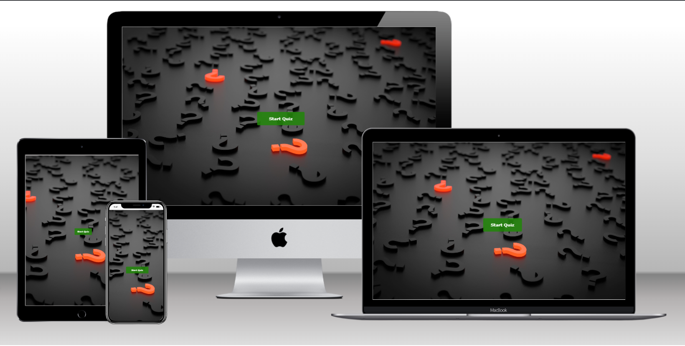
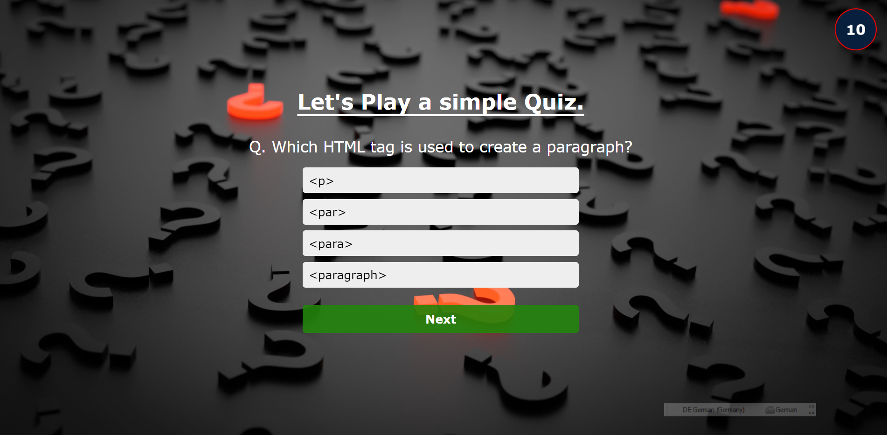
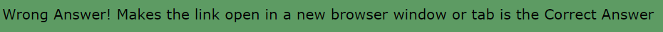
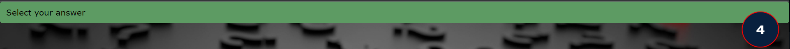
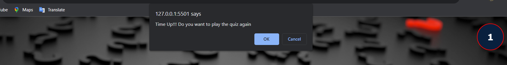
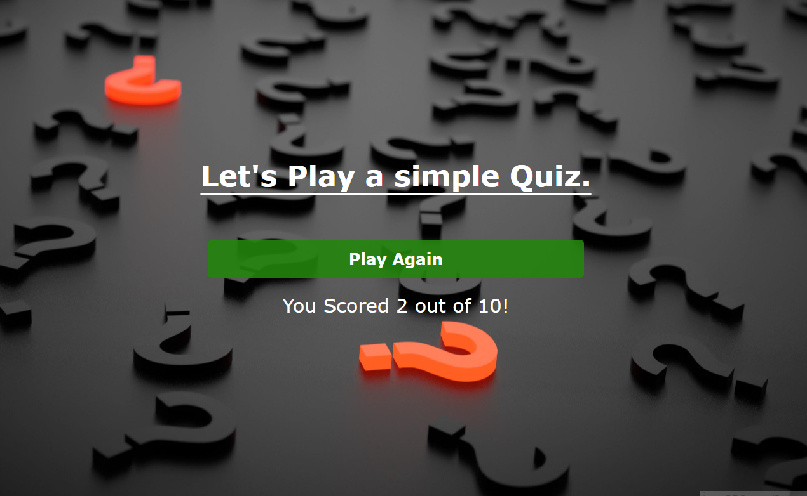
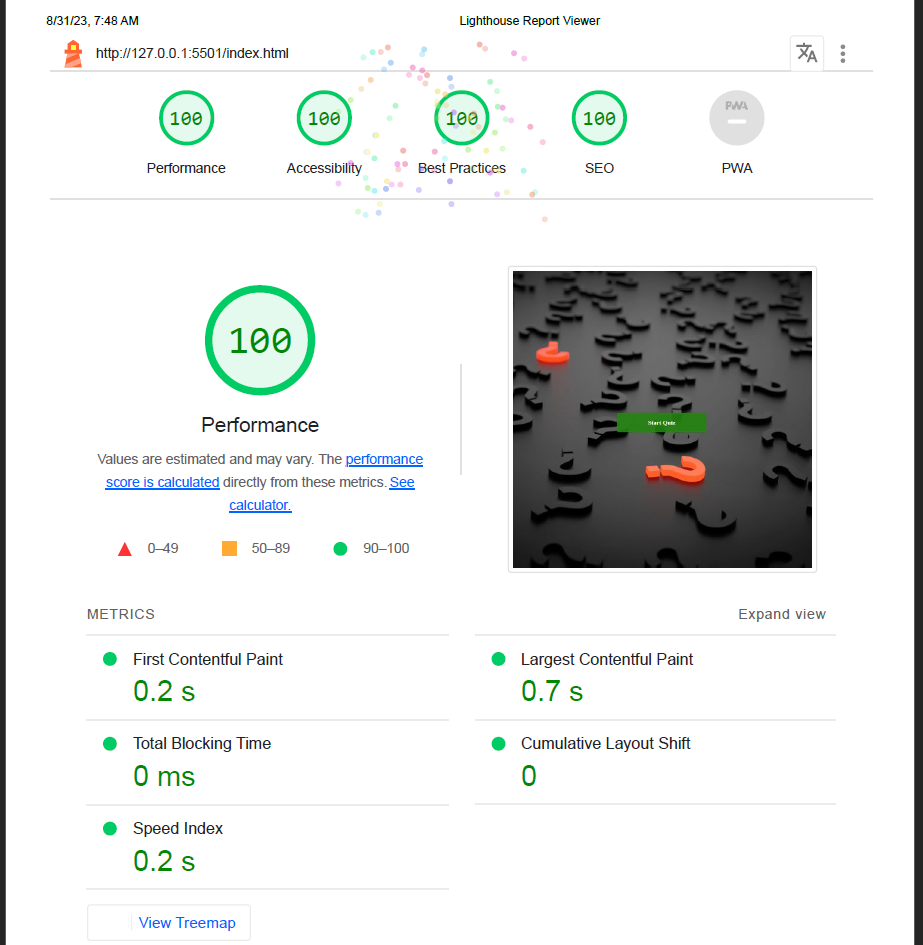

# simple-Quiz-game
 A simple quiz game built using HTML, CSS, and JavaScript.

## Description

This project is a web-based quiz game that presents users with multiple-choice questions and evaluates their answers. The game includes a timer, alerts for correct and incorrect answers, and a scoring system. The project is designed to be responsive and user-friendly.

## Features

* Homepage
* quiz
* Timer
* Questions
* Alert
* ScoreCard

 ### Homepage :

 The Home page contains a Start Button where the User can do click and hover operations on it.Once Start button is clicked,it takes user to the quiz page.

 

* Homepage background image:

### Quiz :

The Quiz page appears once the user clicks on the start-button.The Quiz page contains a header saying that Lets play a simple Quiz,
displays question with multiple choices where user can select one or more answers by clicking on them.

### Timer:

The User once starts the quiz,he or she will be provided with question and multiple choices,where each question is given a time limit time of 15 seconds,timer starts countdown from the movement quiz is started.timer is having animation of pulse where user can have easy note on time for the question.

* timer image:

### Qusetions :

The question section contains  10 questions with multiple choices and everytime user finishes the quiz and wants to play again the questions  will be shuffled.

### Alert :

The Alert message used here is customized.
Alert message is shown when the user attempts to  move to next question with out selecting any answer, when the selected answer is correct or wrong and when user runs out of time there will be a default user confirmation alert asking user either wants to continue the quiz or to cancel quiz game.when the user clicks okay button the quiz game starts,if user clicks on the cancel button user will be navigated to startpage or Homepage.

* when the user answer's correctly,A alert will pop up saying correct answer.

* If user selects wrong answer,a alert message will pop up saying Answer is worng at same time it shows correct answer for that question

* When user doesnot select any answer and tries to go for next question, an alert message will pop up asking to select answer.

* when user runs out of time a default user confirmation alert popups 

### Scorecard :
Scored shows Quiz result and contains a play Again button,if user clicks play again button the quiz will restarted.

 

## Testing :

* I tested that this page work on different browser like Chrome and firefox.
* I confirmed that this page is fully responsive on all types of standard screen sizes using dev-tools device toolbar.
* I confirmed that all buttons,choices for questions are readable and easy to understand.

## Bugs :

#### solved all the bugs

* When i deployed my project to GitHud pages the timerand animation effect are not working.(due to page is not fully deployed)

## Validator Testing:

* HTML:-
    - No error were found when passing through the offical W3C HTML validator. 

* css:-
    - No error were  found when passing through the W3C CSS Validator (Jigsaw).

* javascript:-
    - No error were found when passing through the JSHint JavaScript Validator. 

* Accessibility:-
    - I confirm that the colors and fonts choosen are easy to read and accessible by running the code through lighthouse in devtools

## Unfixed bugs
Timer doesn't shows 0 when the limit is finished.

## Deployment
* This site was deployed to GitHud pages and the steps to deploy are as follows:
    - In the GitHud respository navigate to Settings tag.
    - From the Source section dropdown menu, select the Master Branch.
    - Onces the Master Branch is selected,the page provide the link to complete website.
The live link can be found here: [click to view site](https://kanchihari.github.io/simple-Quiz-game/)

## Credits
* Content
    - The code to make footer,header and singup form is take from the [Love Maths Walkthrough Project]() project.
    - For timer function is taken from the [w3schools](www.W3schools.com),[stackoverflow](www.stackoverflow) and [chatgpt](www.chatgpt).

 Media
    - The image used for backgroung are taken from [unsplash.com](https://unsplash.com/).
